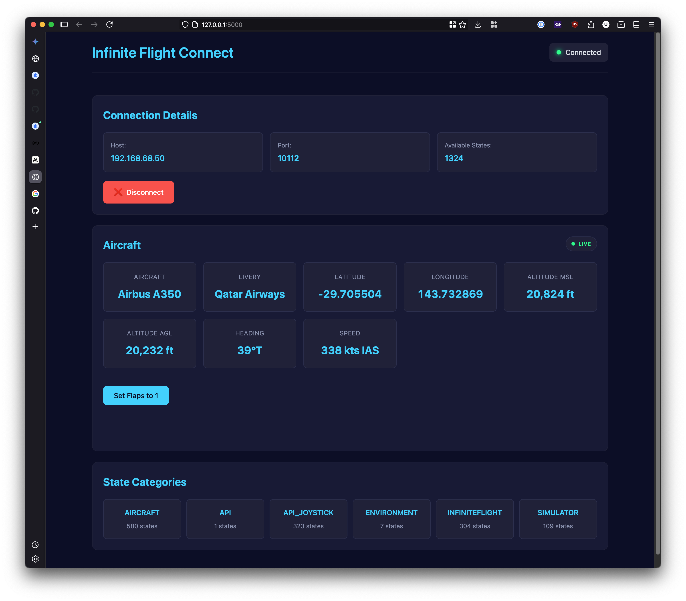

# PyFinite Flight

A Python client for discovering, connecting to, and interacting with Infinite Flight sessions via the Connect API v2. Includes a web interface for real-time monitoring and control.

## Features

-   UDP broadcast discovery of Infinite Flight devices on the network.
-   TCP socket connection to Infinite Flight Connect API v2.
-   Automatic manifest retrieval for available states and commands.
-   Reading aircraft states (position, speed, attitude, systems, etc.).
-   Setting aircraft states (e.g., flaps).
-   Async/await support for API interactions.
-   Flask-based web interface with real-time WebSocket communication.

### Web Interface

The project includes a Flask-based web interface for interacting with Infinite Flight.



**Features:**
-   Real-time device discovery.
-   Visual connection management.
-   Display of aircraft information (Aircraft, Livery, Location, Speed, Altitude, Heading).
-   **Flight Plan Display**: Shows current flight plan details, including bearing, desired track, distances, ETAs, ETEs, current track, next waypoint information, cross-track error, and a list of all waypoints with their types and altitudes. This data is updated periodically.
-   Categorized browsing of all available aircraft states.
-   Ability to set specific states (e.g., "Set Flaps to 1" button).
-   Responsive design.

**Setup & Run:**

1.  **Set Environment Variables**:
    As mentioned in Configuration, ensure `FLASK_SECRET_KEY` is set.

2.  **Run the Web Server**:
    From the project root directory:
    ```bash
    python app.py
    ```

3.  Open `http://localhost:5000` in your browser.

## Project Structure

```
pyfinite-flight/
├── src/
│   ├── api/
│   │   ├── __init__.py
│   │   └── client.py       # Core Infinite Flight API client
│   └── __init__.py
├── static/                 # CSS, JavaScript for web interface
├── templates/              # HTML templates for web interface
├── app.py                  # Flask application
├── test/                   # Test scripts
├── .gitignore
├── pyproject.toml
├── README.md
└── requirements.txt
```

## Installation

1.  Clone the repository:
    ```bash
    git clone https://github.com/your-username/pyfinite-flight.git
    cd pyfinite-flight
    ```
2.  Create and activate a virtual environment (recommended):
    ```bash
    python -m venv venv
    source venv/bin/activate  # On Windows: venv\Scripts\activate
    ```
3.  Install dependencies:
    ```bash
    pip install -r requirements.txt
    ```
    If you intend to modify the client library itself, install in editable mode:
    ```bash
    pip install -e .
    ```

## Configuration

### Environment Variables
The web interface uses a Flask secret key. Set this as an environment variable:
```bash
export FLASK_SECRET_KEY='your_very_strong_and_unique_secret_key'
# On Windows, use: set FLASK_SECRET_KEY=your_very_strong_and_unique_secret_key
```
Replace `'your_very_strong_and_unique_secret_key'` with a randomly generated string.

## Usage

### Infinite Flight Client (Library)

Ensure Infinite Flight is running on a device on the same network and "Infinite Flight Connect" is enabled in Settings > General.

#### Basic Discovery and Connection

```python
import asyncio
from src.api.client import InfiniteFlightClient # Adjusted import

async def main():
    # Discover Infinite Flight devices
    client = InfiniteFlightClient()
    devices = await client.discover_devices(timeout=5.0)
    
    if devices:
        device = devices[0]
        print(f"Found: {device['deviceName']} - {device['aircraft']}")
        
        # Connect to the device
        # Use the specific IP and port from the discovered device
        client = InfiniteFlightClient(
            host=device.get('preferred_ip', device['address']),
            port=10112 # Connect API v2 is on port 10112
        )
        
        if await client.connect():
            print("Connected!")
            # Connection established, manifest is automatically fetched.
            # You can now get or set states.
            await client.disconnect()
            print("Disconnected.")
        else:
            print(f"Failed to connect: {client.last_error}")
    else:
        print("No devices found.")

if __name__ == "__main__":
    asyncio.run(main())
```

#### Reading Aircraft States

```python
import asyncio
from src.api.client import InfiniteFlightClient # Adjusted import

async def read_aircraft_states():
    client = InfiniteFlightClient()
    devices = await client.discover_devices()
    
    if devices:
        device = devices[0]
        client = InfiniteFlightClient(
            host=device.get('preferred_ip'),
            port=10112 
        )
        
        if await client.connect():
            print("Connected to read states.")
            try:
                altitude = await client.get_state("aircraft/0/altitude_msl")
                speed = await client.get_state("aircraft/0/indicated_airspeed")
                heading = await client.get_state("aircraft/0/heading_magnetic")
                
                print(f"Altitude: {altitude:.1f} ft" if altitude is not None else "Altitude: N/A")
                print(f"Speed: {speed:.1f} kts (IAS)" if speed is not None else "Speed: N/A")
                print(f"Heading: {heading:.1f}°" if heading is not None else "Heading: N/A")
                
                states = client.get_available_states()
                print(f"Total available states: {len(states)}")
            except Exception as e:
                print(f"Error reading states: {e}")
            finally:
                await client.disconnect()
                print("Disconnected.")
        else:
            print(f"Failed to connect: {client.last_error}")
    else:
        print("No devices found.")

if __name__ == "__main__":
    asyncio.run(read_aircraft_states())
```

#### Setting Aircraft States

```python
import asyncio
from src.api.client import InfiniteFlightClient # Adjusted import

async def set_flaps_example():
    client = InfiniteFlightClient()
    devices = await client.discover_devices()

    if devices:
        device = devices[0]
        client = InfiniteFlightClient(host=device.get('preferred_ip'), port=10112)

        if await client.connect():
            print("Connected to set states.")
            try:
                # Example: Set flaps to position 1
                # Note: Flap positions are integer indices and vary by aircraft.
                # 'aircraft/0/systems/flaps/state' is a common state name.
                flaps_state_name = "aircraft/0/systems/flaps/state"
                
                # First, get current flaps state (optional, for context)
                current_flaps = await client.get_state(flaps_state_name)
                print(f"Current flaps state: {current_flaps}")

                new_flaps_value = 1 
                print(f"Attempting to set flaps to: {new_flaps_value}")
                await client.set_state(flaps_state_name, new_flaps_value)
                print(f"Flaps state set command sent.")

                # Verify by getting the state again (API doesn't confirm set)
                # Allow a moment for IF to process
                await asyncio.sleep(0.5) 
                updated_flaps = await client.get_state(flaps_state_name)
                print(f"Updated flaps state: {updated_flaps}")

            except ValueError as ve:
                print(f"State error: {ve}")
            except NotImplementedError as nie:
                print(f"Feature not implemented in client: {nie}")
            except Exception as e:
                print(f"Error setting state: {e}")
            finally:
                await client.disconnect()
                print("Disconnected.")
        else:
            print(f"Failed to connect: {client.last_error}")
    else:
        print("No devices found.")

if __name__ == "__main__":
    asyncio.run(set_flaps_example())
```

## Device Discovery Information

The `discover_devices()` method returns a list of devices, each a dictionary containing:
-   `state`: Current state (e.g., "Playing", "Menu")
-   `port`: TCP port for Connect API v1 (Note: v2 is on 10112)
-   `deviceId`: Unique device identifier
-   `aircraft`: Current aircraft type
-   `version`: Infinite Flight version
-   `deviceName`: Name of the device
-   `addresses`: List of IP addresses for the device
-   `preferred_ip`: The recommended IP address to use for connection
-   `livery`: Current livery name

## Available Aircraft States

The client can read and potentially set various aircraft states. The full list is available via the manifest after connecting. Common categories include:
-   **Position**: latitude, longitude, altitude (MSL/AGL)
-   **Attitude**: heading, pitch, bank/roll
-   **Speed**: indicated airspeed, true airspeed, ground speed, vertical speed, mach
-   **Systems**: landing gear, flaps, autopilot, lights, engines
-   **Flight Info**: livery, weight, fuel, is_on_ground

## Test Scripts

The `test/` directory contains utility scripts:
-   `get_all_states.py`: Connects to a device and dumps all available states and their current values to a JSON file. (Note: You might need to update imports in this script if they are relative and you run it from a different directory).
-   Other test scripts (`test_discovery.py`, `test_sessions.py`, `test_states.py`) may exist and might require updates to reflect current API client usage.

## Requirements

-   Python 3.7+
-   Flask, Flask-SocketIO, Flask-CORS (see `requirements.txt`)
-   Infinite Flight (version 19.4+ for API v2) with "Infinite Flight Connect" enabled in General Settings.
-   Both the device running this client and the device running Infinite Flight must be on the same local network.
-   An active flight session in Infinite Flight is typically required for most aircraft states to be meaningful.